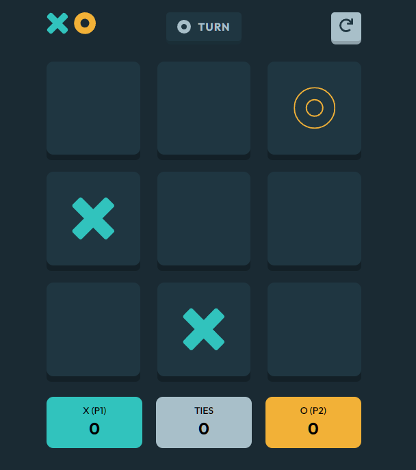

# Front End Mentor Tic Tac Toe Challenge (Intermediate)

This project was bootstrapped with [Create React App](https://github.com/facebook/create-react-app).
This project is is from FrontEndMasters, [Tic Tac Toe Challenge (Intermediate)](https://www.frontendmentor.io/challenges/tic-tac-toe-game-Re7ZF_E2v/hub/tic-tac-toe-game-y4th6eCpN)

# Stack Used

The main focus of the project was to use React and a better feel of the various hooks, learn how to use Styled components to the best of its abilities, and get better with testing React components and unit testing.

# Problems faced

One major issue was testing React apps, I had used jest to unit test functions before, but not test components themselves, completing this project helped me get a better grasp of the user event aspect of jest, more about grabbing components with various jest methods (query by, find by) and how to test react components without having to interact with them directly.

I have been learning about cypress recently, so I plan to try it out with this project in the future.

# Things I would have done better

For the styled components, it would have been best to put the color schema into its own file and extract from there instead of manually inserting the color hex codes.

I need to get a better undestanding of the react hooks such as Ref and layout, I believed they would have helped me cut down on some of the code, and creating some custom hooks would have helped as well.

I was able to get the cpu move to fire off every time the gameboard re-rendered, but using context I believe I should have created seperate game boards for cpu and player type games.

## Available Scripts

In the project directory, you can run:

### `npm start`

Runs the app in the development mode.\
Open [http://localhost:3000](http://localhost:3000) to view it in the browser.

The page will reload if you make edits.\
You will also see any lint errors in the console.

### `npm test`

Launches the test runner in the interactive watch mode.\
See the section about [running tests](https://facebook.github.io/create-react-app/docs/running-tests) for more information.

### `npm run build`

Builds the app for production to the `build` folder.\
It correctly bundles React in production mode and optimizes the build for the best performance.

The build is minified and the filenames include the hashes.\
Your app is ready to be deployed!

See the section about [deployment](https://facebook.github.io/create-react-app/docs/deployment) for more information.

### `npm run eject`

**Note: this is a one-way operation. Once you `eject`, you can’t go back!**

If you aren’t satisfied with the build tool and configuration choices, you can `eject` at any time. This command will remove the single build dependency from your project.

Instead, it will copy all the configuration files and the transitive dependencies (webpack, Babel, ESLint, etc) right into your project so you have full control over them. All of the commands except `eject` will still work, but they will point to the copied scripts so you can tweak them. At this point you’re on your own.

You don’t have to ever use `eject`. The curated feature set is suitable for small and middle deployments, and you shouldn’t feel obligated to use this feature. However we understand that this tool wouldn’t be useful if you couldn’t customize it when you are ready for it.

## Learn More

You can learn more in the [Create React App documentation](https://facebook.github.io/create-react-app/docs/getting-started).

To learn React, check out the [React documentation](https://reactjs.org/).
